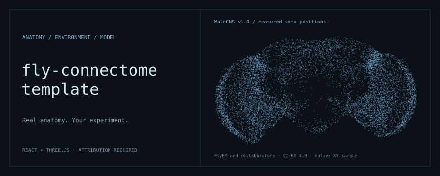

<p align="center">
  
</p>

# Fly Snake

**A real fruit fly's complete brain wiring, simulated and untrained, plays Snake. Silence two cells and watch what it loses.**

Fly Snake simulates all 165,000 neurons and 6 million connections of the MaleCNS v1.0 fly connectome and lets it play
Snake in the browser, with the brain lighting up next to the game. The game reaches the fly through real sensory cell
types and the move comes from its real output neurons. **The brain's connections are never changed or trained.**
Snake is not the point. It is how we test what the wiring does.

## What we found

| | Result |
|---|---|
| **Nothing trained, real wiring** | The fly's own steering neuron (DNa02) and escape neuron (giant fiber, DNp01) play the game: 5.9 food and 63 moves per game |
| **Silence the 2 steering cells** | 1.1 food, but it survives 170 moves: it wanders and still dodges walls |
| **Silence the 2 escape cells** | It still goes for food, and dies after 25 moves instead of 63 |
| **Silence 2,000 random cells** | No change (6.4 food) |
| **Scramble the wiring** (same neurons, same connection strengths, random targets) | 0.00, 0.00 and 0.09 food in three scrambles, against 2.28 for the real wiring under the same earlier rule |
| **Found by searching the wiring** | Food signals reach the steering neuron only through about a dozen relay cells in the anterior optic tubercle, the pursuit pathway known from real flies. Silencing them: 0.8 food |
| **Learning from reward** (a readout of under 4,000 numbers; the brain stays fixed) | Real wiring 22.0 food over ten runs, scrambled wiring 5.1 |

Every number comes from a script in `scripts/` and is recorded, with its caveats, in [AGENTS.md](AGENTS.md).

**What is honest to say.** Everything on screen is simulated activity, never recorded from a fly. The neuron model is
heavily simplified (after Shiu et al. 2024). We chose how game events become sensory input, one global synapse-strength
factor, and three thresholds in the untrained rule. A *trained* readout also plays through a scrambled brain (14.3
against 18.8), so the claims rest on the untrained mode, the lesions and the scrambled control. In Training only the
small readout learns.

## On the page

- **Layouts:** one fly, a swarm of sixteen independent brains, or you against the fly.
- **Brain modes:** Trained · **Normal** (nothing trained) · Scrambled (the control) · Training (a blank readout learns
  from reward; the audience can reward and punish moves from their phones by QR code).
- **Lesion lab:** click boards to pick flies, then silence the steering neuron, the giant fiber or the food relay cells.
  Silenced cells are ringed in the brain view.
- **Pathways:** the brain view draws the circuits carrying food pursuit, escape, turning away, feeding and pain, and
  pulses them with the game.
- When the snake eats, the fly's sugar-taste neurons fire and its feeding motor neuron responds. When it dies, its heat
  sensors fire and the punishment dopamine neurons respond.

## Run it

Python 3.12, Node.js 22.18+, and an NVIDIA GPU if you want more than one fly at a comfortable speed (CPU works).

```sh
# one-time: environment and about 565 MB of connectome data (into data/, gitignored)
uv venv --python 3.12 && uv pip install torch --index-url https://download.pytorch.org/whl/cu126
uv pip install pandas pyarrow numpy scipy fastapi "uvicorn[standard]"
B=https://storage.googleapis.com/flyem-male-cns/v1.0/connectome-data/flat-connectome; mkdir -p data; cd data
curl -LO $B/body-annotations-male-cns-v1.0-minconf-0.5.feather -O $B/body-neurotransmitters-male-cns-v1.0.feather \
     -O $B/connectome-weights-male-cns-v1.0-minconf-0.5-traced-only.feather; cd ..

# every time: two terminals
.venv/Scripts/python -m uvicorn flybrain.server:app --port 8000 --host 0.0.0.0   # brain server (macOS/Linux: .venv/bin/python)
npm ci && npm run dev                                                             # the page; open the address it prints
```

The first start takes about a minute while the connectome loads. Trained readouts are committed in `models/`, so nothing
needs training before the demo. The simulation idles while the page's tab is hidden, and a thermal guard slows it down
if the GPU runs hot (`FLY_THERMAL_GUARD=on|slow|off`, see [AGENTS.md](AGENTS.md)).

## Read more

- [Demo run sheet](docs/DEMO-SCRIPT.md): what to click and what to say, in four minutes.
- [Pitch notes and judge questions](docs/PITCH.md): the numbers you can defend and the answers to the hard questions.
- [AGENTS.md](AGENTS.md): file map, WebSocket protocol, every finding with its caveats.
- [Survival training](docs/TRAINING.md) and [evolved readouts](docs/EVOLUTION.md).

Built with [fly-connectome-template][repo] by [Mert Cobanov][author], modified. Connectome: MaleCNS v1.0, FlyEM / HHMI
Janelia, University of Cambridge, MRC Laboratory of Molecular Biology and Google Research, CC BY 4.0. See [Licence](#licence).

## Training, audience phones and the operator page

This fork also includes the Fly Snake simulator and trained descending-neuron
readout. See [survival training and measured results](docs/TRAINING.md) for the
training command, comparison with the original model, and remaining limitations.

For reward-driven training over thousands of generations, see
[evolution training and independent evaluation](docs/EVOLUTION.md). The trainer
starts random linear readouts, evolves them from game scores, and keeps the
connectome fixed. The saved experimental winner has not replaced the demo model.

**Retrain existing readout** starts live learning from a copy of the trained
model; **Start blank** starts over. Positive and negative
stimuli train the move displayed when clicked, with adjustable strength and
per-fly or all-fly targeting. The interface confirms accepted feedback and explains
rejections. Food and collisions also provide automatic rewards. Live changes last
for the server session; saved models and connectome synapses stay unchanged.
Resume a paused game before sending feedback.

**Audience training by QR code:** choose **Training**, then scan **Train from your phone** in Live learning.
The phone page shows the live board with positive/negative stimulus buttons and confirms each tap separately.
It trains the same shared readout as the host; it cannot change experiment modes. For a local demo, start the
brain server with `.venv/Scripts/python -m uvicorn flybrain.server:app --host 0.0.0.0 --port 8000`, allow its
port through the local firewall, and put phones on the same Wi-Fi or hotspot. If multiple network addresses
appear, select the demo's Wi-Fi address above the QR code. The controller is served by the brain server at
`http://<server-ip>:8000/feedback/`, so phones do not need access to Vite. For remote audiences, expose the brain
server through your HTTPS reverse proxy (including WebSocket upgrades) and set `FLY_FEEDBACK_URL` to its
public `/feedback/` URL. The QR code is generated locally; no external QR service receives the link.

**Eduroam / campus Wi-Fi:** a private LAN address may be unreachable between devices. Use a free HTTPS
tunnel for the demo so visitors can stay on eduroam or mobile data. The included gateway serves only the
phone page and forwards its feedback socket to the running experiment:

```sh
.venv/Scripts/python scripts/audience_gateway.py --brain-ws ws://127.0.0.1:8000/feedback/ws --port 8002
cloudflared tunnel --url http://127.0.0.1:8002 --protocol http2
```

Use the brain server's actual port in `--brain-ws` (the separate preview uses `8001`). Install `cloudflared`
from [Cloudflare's official downloads](https://developers.cloudflare.com/cloudflare-one/connections/connect-networks/downloads/).
Set `VITE_FEEDBACK_URL=https://<assigned-name>.trycloudflare.com/feedback/` when starting Vite or building the
frontend; this replaces the QR link without restarting the brain or discarding its learner. With PowerShell:
`$env:VITE_FEEDBACK_URL = 'https://<assigned-name>.trycloudflare.com/feedback/'`, then run the usual frontend command.
Keep the laptop, gateway and tunnel running. A Quick Tunnel has a temporary URL that changes when restarted;
update `VITE_FEEDBACK_URL` and refresh the host page after restarting it. For a recurring event, use a named
tunnel and a stable hostname. The host's mode controls at `/ws` are not exposed by the gateway.

**Private operator page:** set `FLY_OPERATOR_KEY` to a long random secret before starting the brain server.
Open `/operator/` on that server and enter the key, or bookmark `/operator/#<key>` to connect directly.
The fragment is removed from the address bar and never sent in HTTP requests. The page has no links from
the main display or audience controller. The key is required for every operator socket connection.
To make this page available through the same HTTPS tunnel, add
`--operator-ws ws://127.0.0.1:8000/operator/ws` to the gateway command (use the actual brain port).
Without that flag it is absent from the gateway; without `FLY_OPERATOR_KEY` it is disabled on the brain.
Keep the private bookmark private. Anyone holding it can select a readout for this session.

Its five choices are Crash fast (straight-biased), Untrained (saved random initial readout), Original trained,
Evolved, and Best saved (current survival-trained readout). These are approximate performance levels;
there is no verified perfect brain model. They apply in Trained or Training with original real wiring.
The full brain still runs each move. Changes preserve the current boards and mode, produce no main-display
notification, and never edit saved models or synapses. Training continues from a copy of the selected
readout, including audience feedback; feedback for decisions before the switch expires. “Return control
to host” restores the previous host readout. A host policy, wiring, learning, or synaptic selection also
clears the override. Restarting the server clears private selection and session learning.

| File | Replace or connect |
| --- | --- |
| `src/components/Environment.tsx` | Your game, video or sensory scene |
| `src/components/BrainScene.tsx` | Your model's `ActivityFrame`, keyed by MaleCNS body ID |
| `src/components/FlyScene.tsx` | Your motor decoder or physics adapter |
| `src/App.tsx` | Experiment clock, controls and replay/live adapter |
| `src/style.css` | Your layout and visual design |

The [model integration guide](docs/MODEL-INTEGRATION.md) covers the JSON format,
Python-side data layout and live adapters. The validator rejects incompatible
datasets, unknown IDs, duplicate IDs, invalid values and unordered timestamps.
It validates the format, not the scientific truth of a model's output.

## What the anatomy means

These are **cell-body positions**, not neurite branches or a synaptic graph.
The source is the adult male MaleCNS dataset, not female FlyWire. Of 140,024
bundled measured positions, the viewer draws 124,289 classified optic, central
and descending somata; it omits VNC-associated and unclassified cells.
Missing positions are never generated.

Native 8 nm coordinates are centered, rigidly rotated and uniformly scaled.
**XY view** resets the projection; **Orbit** controls rotation. Point size and
color are display choices. Flybody is a surface mesh here, not a physics
simulation. This fork's Snake extension adds a neural simulator and trained
readout. Its activity is simulated, never biological firing recordings.

The [atlas manifest](public/data/brain-atlas/manifest.json) records source,
filters and hashes. The [data notice](public/data/brain-atlas/NOTICE.md)
includes the command to reproduce or audit the export. The header image is a
sample of those same measured coordinates.

## Verify and deploy

```sh
npm test                # model-output contract and the bundled fixture
npm run check:assets    # anatomical asset hashes
npm run build           # type check and static build
npm run preview         # inspect dist/ locally
```

GitHub Actions runs the same checks. Serve `dist/` on any static host; assets
also work under a subpath. On Cloudflare Pages, use build command
`npm run build` and output directory `dist`. GPU training and inference run
separately and provide replay files or live outputs to the frontend.

## Licence

**[Cobanov Template Attribution License 1.0](LICENSE)** is a custom,
attribution-required source-available license, not an OSI-approved license.
Keep this linked credit in both your web UI and repository README:

Built with [fly-connectome-template][repo] by [Mert Cobanov][author].

The ready-made UI credit is `src/components/Attribution.tsx`. You may restyle it
or move it to an About/Credits view reachable in one click from the main UI;
you may not hide it or remove its links. [ATTRIBUTION.md](ATTRIBUTION.md) explains
the requirements. Derived versions must identify that they were modified.
Your own models, weights and modifications do not have to be published.

MaleCNS data remains **CC BY 4.0**, credited to FlyEM / HHMI Janelia, University
of Cambridge, MRC Laboratory of Molecular Biology and Google Research.
Flybody remains **Apache-2.0**. Their licenses are separate from the template's;
see [third-party notices](THIRD_PARTY_NOTICES.md).

[repo]: https://github.com/cobanov/fly-connectome-template
[author]: https://github.com/cobanov
[generate]: https://github.com/new?template_name=fly-connectome-template&template_owner=cobanov
